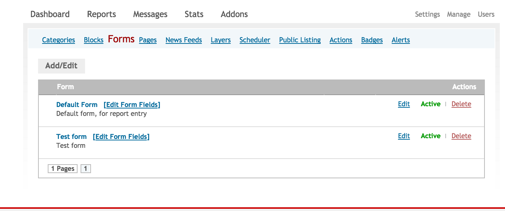

# 2. Customizing your deployment

## 2.1 Accessing your admin panel

### 2.1.1 Log in								

If your website is www.yourdomain.com, the administration login would be available at http://yourdomain.com/admin, or http://yourdomain.com/login. It will look like this: 

Enter the username and the password to access the Admin page. 

### 2.1.2 Create an account

If you don’t already have an account, you can create one and an administrator will upgrade your access level, then you can log in.

## 2.2 Modifying settings

The Settings section is the page where the administrator can set up all the settings to customize the Ushahidi platform based on the project they are working on. This section of the Ushahidi platform is the first one that needs to be customized once the platform is installed and allows for the main components of the platform, such as the map and the email address, to be set up by the administrator.

To access the Settings Page the administrator just needs to click on the Settings tab, on the top right of the Dashboard page

### 2.2.1 Site Settings

The Website page is the one where the administrator chooses the main appearance settings of the Ushahidi platform, mainly the characteristics of the homepage, the main navigation, and the contact information.

*1. Site Name*

This is the main title that appears on the right side of the your homepage and it is normally the title of your project.

*2. Site tagline*

This is the tagline that appears below the title on the homepage, which normally gives more detailed description of what the platform is about or what the platform intends to monitor or show.

*3. Site Banner*

You can upload your own custom banner to appear on the homepage of your deployment

*4. Site Email Address*

This is the email address that will be shown in the Information Box on the homepage, which is the one that users will use to email you information or reports. This email address is also the same one that the contact form on the main page is linked to, and the email from which alerts are sent out from.  If this text field is left blank, the contact page and alerts pages on the homepage will not be visible.

This email address will be publicly displayed on the website, so it is recommended that you create an email address specifically for this, and not to use a personal one.

*5. Site Message*

The Site Message is an optional message that you can add on the top of your user page and that can be used for different purposes: you can use it to advertise your short code, if you have one; to put a disclaimer of responsibility, or anything else you want to let people know straight forward.

*6. Site Copyright Message*

The Copyright message allows you to set the kind of copyright license your platform submitted is under. The message will appear on the bottom of the homepage.

*7. Submit Report Message*

This is an optional message that you can add at the top of your report submission page to provide users with additional instructions on how to go about report submission.

*8. Site Language*

This allows you to set the default language your Ushahidi platform will be available in.  This function translated all sections of the Ushahidi platform, excluding custom form fields, and is also dependent on the level of completeness for the language selected.

*9. Timezone*

This option allows you to set the default time zone your deployment spans, and will reflect on report time entries.

*10. Display Contact Page*

This allows you to set the option to have the Contact page in the main Toolbar on the homepage or not.  If "No" is selected, the page will not be available for users to contact the administrators of the Platform, but they will still be able to send emails to the address showed on the homepage if configured.

*9. Item per page – Front End*

You can choose how many items will be displayed in the pages opened by the user, such as the Reports page or the News Feeds page. E.g, setting it to 5 items will display 5 reports/newsfeed items on the homepage.

*10. Item per Page – Admin*

You can choose how many items will be displayed in the Admin page, like the Reports page or the Message page. e.g setting this to 5 items will display 5 reports on the admin reports listing page

*11. Blocks per row*

This option allows you to set the number of blocks to be seen on a particular page

*12. Allow Users to Submit Reports*

You can decide to allow users to submit reports onto the platform or not via the online form. If NO is selected, the report submission page will not be available for users to submit reports directly on but they will still be able to send emails to the address showed on the homepage or to send SMS if configured.

*13.  Allow users to subscribe for alerts.*

You can also decide to allow users to subscribe for alerts from the platform. Setting this option to NO disables the "Get alerts" link on the homepage, and users are not able to subscribe for alerts

*14. Allow Users to Submit Comments to Reports*

This option gives you the ability to allow users to submit comments to reports, and decide if they are auto approved, or if they need moderation.

*15. Include RSS News Feed on the Website*

This option allows you to decide to add RSS Feeds Box displayed on the homepage and allow for access of data from the platform via an RSS feed.

*16. Create new Category from Feeds*

This allows for automatic creation of new categories from news feeds.

*17. Feeds geolocation - Geonames username*

If you want to geocode your news feed items/feed entries, you need to create an account at [http://geonames.org](http://geonames.org), enable the free web services and enter it in this section. Leaving this blank disables this function

*18. Enable Statistics (Stored on Ushahidi's server)*

Hit statistics are stored on a server controlled by Ushahidi. By enabling this option, you gain access to hit statistics directly in your admin panel. By disabling it, you will stop collecting statistics and will be unable to recover traffic stats collected while this is turned off.

*19. Cache Pages*

The administrator may decide whether to cache pages and reports on the website, speeding up loading time. This is particularly helpful when working with low-bandwidth audiences.

*20. Cache Pages Lifetime*

If caching is enabled, here the administrator may set how long the pages are cached for before users visiting pages on the website should be served a new version of the page rather than the cached version saved on their personal computer.

*21: Private deployment*

This option gives you the option of having your map publicly available, or limiting access to specific users on the platform. If you set this option to "Yes" - users will have to log into the platform to view the map and data in it.

*22. Manually Approve Users*

If you set this option to yes, you must approve all individual users who create accounts on your deployment by assigning them roles e.g. Superadmin, Admin, member

*23. Require User Email Confirmation*

Users will be emailed with a confirmation link to click before they are allowed to log into the deployment if this is set to yes. If you enable this after your deployment has accepted users, they will be prompted to confirm their account before they will be allowed to continue using it.

*24. Google Analytics*

This function allows the administrator to sync the platform with Google Analytics by inserting the proper ID.13

*25. Akismet Key*

The Akismet Key allows the administrator to have Akismet pre-screening the messages coming in to look for spam. To be able to use this function the administrator needs to be registered for a WordPress account and get a free API key.

### 2.2.2 Map Settings

This section allows you to select which type of base map you want for your project. This section guides you step by step in the setting up of the base map.

#### 2.2.2.1 Default Location

You can set the country your deployment is being set up from this section, and retrieve cities from this country to be populated on the report submission page.

"Does this deployment span multiple countries"

Setting this option to No will only permit submission of reports tagged to locations within the default country set above.

Setting this option to Yes will permit submission of reports tagged to locations anywhere around the world

#### 2.2.2.2 Map Timeline

If you’re using the following themes, you can enable or disable the timeline below the map, and set it either as a line or bar graph:-

* Bueno

* Default

* Terra

#### 2.2.2.3 Map Provider

There are four default providers to chose from:-

* ESRI

* Google

* Bing

* OSM

By default, Ushahidi installations have the map provider set to OSM. Select the one you would prefer from this section

#### 2.2.2.4 Configure Map

This section of the Map page allows you to choose the default zoom of the map appearing in the main homepage. To choose the default zoom level, move the indicator on the bar and wait for image below to show the map relative to that zoom level. Once the zoom level has been chosen no other action is required other than to leave the marker on the right position in the bar.

On the right side of the zoom level bar there are two boxes indicating the GPS coordinates of the red marker in the map. This is where the red marker will appear to the user who is submitting a report from the web form, and can be set to the main city of the country for example, or left as default in the center of the country. Note that a user who subsequently submits a report will not be constrained to the exact location of the default marker.

Those two actions, setting the zoom level and the position of the red marker, can be done also just by using the mouse and clicking on the map. It is possible to position the red marker by double clicking on the right location. By grabbing the map and moving it, you can decide which section of the map will be visible to the user on the homepage.

Once all the settings in the map page have been set, they can be saved by clicking on the "Save Settings" tab on the bottom of the page. Every time one of the settings is changed, you are required to save the settings again.

#### 2.2.2.5 Cluster reports on Map

This feature allows you either bundle similar reports on a map into a single dot or not on the main map. Setting this option to **yes** will bundle the reports, while setting it to **No** will leave each report denoted by a single red dot on the map on the homepage.

#### 2.2.2.6 Default color for all categories

This section gives you the ability to set one color code for all categories displayed on the homepage.

#### 2.2.2.7 Default icon for all categories

This section gives you the ability to set one icon for all categories displayed on the homepage.

### 2.2.3 SMS Settings

This page allows you to set up phone numbers through which you will be able to receive SMS messages from.

There are two possible ways of setting up the Ushahidi platform to receive SMS directly into the platform:-

* Using FrontlineSMS

* Using SMSSync

1. You’ll need to activate either one of the two plugins mentioned above in the [addons section](#heading=h.pobx4rwsacwd) before proceeding any further. 

2. Once done, select the default provider(SMSSync/FrontlineSMS) from which you will receive sms messages from.

3. Next, enter all the phone numbers that user will be able to send text messages into the system from.

#### 2.2.3.1 Using FrontlineSMS

This section explains how to use FrontlineSMS v2.2+ with Ushahidi. [Instructions on using v1.7 of FrontlineSMS can be found on our wiki.](https://wiki.ushahidi.com/display/WIKI/Connecting+FrontlineSMS+v1.7+to+Ushahidi)

[FrontlineSMS](http://www.frontlinesms.com/) and [Ushahidi](http://ushahidi.com/) are free and open source software tools, widely used by social change projects the world over. FrontlineSMS is used to enable users to send, receive and manage large numbers of incoming and outgoing SMS. Ushahidi is a platform for information collection, curation, and geospatial visualization. Used together, these tools can produce powerful results, with FrontlineSMS managing incoming mobile data and Ushahidi handling the visual representation.

##### 2.2.3.1.1 Technical requirements

* FrontlineSMS software ([free to download](http://www.frontlinesms.com/the-software/download))

* A USB modem or phone and cable [compatible with FrontlineSMS](http://www.frontlinesms.com/the-software/requirements/) for receiving SMS

* The Ushahidi platform: Either the self-hosted [Ushahidi Platform](http://download.ushahidi.com/) or an account and active deployment with the our cloud-hosted [Crowdmap](http://www.crowdmap.com/) service

* A mobile phone for sending SMS to test

* An Internet connection

##### 2.2.3.1.2 Steps to follow

* Download and install v2.2+ of [FrontlineSMS](http://www.frontlinesms.com/the-software/download/). Their walkthrough installer is like installing most any other software on your computer and should be fairly straightforward.

* Navigate to the Addons page, and look for the FrontlineSMS plugin. We’ll need to retrieve a key piece of information we'll need to plug into FrontlineSMS: the "Sync Key." You can find this by clicking the 'Settings' link next to the "FrontlineSMS" title of the addon. This will open the FrontlineSMS addon settings where you will find the Sync Key. Copy this key; we'll cover where to plug it in in the next step.  (*Note: You may ignore the "FrontlineSMS HTTP Post Link" URL as that pertains to the 1.X versions of FLSMS.*) 

* On the left sidebar, click on the "Create new activity" under the "Activities" section.

* A new window will appear and you will be presented with a number of options. Choose "Web Connection" at the bottom of the list.

* Selecting Web Connection will present a new set of options. Select "Crowdmap / Ushahidi" and click "Next" at the bottom right.

* Click the Ushahidi button and add the following settings: Add your custom URL and API key (the "Sync Key" from your deployment). Once you've entered this, click the "Next" button at the bottom right and you'll come to some final configuration options.

* On this screen, you have the option to configure FrontlineSMS to automatically move messages into your Web Connection and pass SMS reports up to Crowdmap. To automatically process SMS in this way select, "Process responses containing a keyword automatically." Alternatively, you can select the "Do not use a keyword" option, which will result in all incoming messages triggering the Web Connection provided they do not match any other activities' keywords. Only one activity at a time can have this setting. The third option, "Do not automatically sort messages," you can also disable automatic sorting altogether. With this setting you can still use your Web Connection's functionality by manually moving messages into your new activity from the inbox or any other activity or folder. This allows you to manually choose which incoming SMS get passed up to Crowdmap. When you have finished setting up your automatic sorting options, you can set your keywords. You can enter any number of keywords separated by commas. With this setting, any incoming message that starts with one of those keywords will trigger the Web Connection. Once you've decided how to deal with incoming messages, click "Next" again at the bottom right.

* Now that the platforms are connected, it's time to do and end-to-end test to ensure that messages received in FrontlineSMS will appear within your Ushahidi or Crowdmap deployment. Begin by connecting FrontlineSMS to a [compatible device](http://www.frontlinesms.com/the-software/requirements/). Test that FrontlineSMS is receiving messages from your mobile phone or modem by sending a couple of SMS, being sure to include a keyword if you specified that. You should see the message come into FrontlineSMS in the "Messages" section, or listed within your activity. A report should then appear in your Ushahidi or Crowdmap installation as well. If it is not working, read through the [user resources](http://www.frontlinesms.com/user-resources/) section of the FrontlineSMS website and check the [Frequently Asked Questions](http://www.frontlinesms.com/user-resources/frequently-asked-questions/). 

#### 2.2.3.2 Using SMSSync

SMSsync is a simple, yet powerful SMS to HTTP sync utility that turns any Android phone into a local SMS gateway by sending incoming messages(SMS) to a configured URL (web service).

* Download the application from the Android Market. Please note that SMSsync works on any SMS-enabled device running Android 2.1 and above. Find the SMSSync plugin on the addons page, and click on *settings *right next to the smssync title to retrieve the Sync URL. You can also optionally set an SMSSync secret key for security purposes 

* Open up the SMSSync Application on your android device. You’ll note that you can manage multiple Sync URLs on the app. 

* To add a new Sync URL:-

* Tap on the Sync URL from the navigation drawer.

* Tap on the Add icon icon on the actionbar. An input dialog should open.

* Enter a title for the Sync URL.

* Enter a secret key if required by the webservices. Make sure you enter the exact key here. The secret key should be presented as string of any characters without spaces.

* Enter a comma separated value for the keyword(s). These keywords will be used by SMSsync to filter incoming SMS and pending messages to the Sync URL you are adding. As of v2.0.2. You can now add Regular Expresssion code for filtering. This means, it can either be CSV or RegExp. It cannot be both.

* Enter the URL for your webservice. Don't forget to start with the HTTP or HTTPS protocol. e.g. https://example.com/api-v1/add-record/

* Tap OK to save the new entry.

* You will now need to start the SMSSync Service to start forwarding messages to the platform. To start the SMSSync service

* Make sure that you have added and enabled(checked) the Sync URL you added above.

* On the SYNC URL screen, tap on the Start SMSsync service to start the service. 

* You should be all set to work with SMSSync and Ushahidi

For more details on how to manage messages within SMSSync, [see configuration instructions on the SMSSync Website](http://smssync.ushahidi.com/configure/)

#### 2.2.3.3 Using Clickatell

* Look for the clickatell plugin on the addons page and activate it.

* Once active, click on "settings" on the side of the plugin name.

* Sign up for Clickatell service by following the link on the page and get an API key.

* Go back to the Clickatell plugin settings page and enter your Clickatell API number that you received after signing up for Clickatell service.

* Enter your Clickatell Username.

* Enter your Clickatell Password. You should get it from Clickatell 

* Click on Save Settings button to save the entries.

The Clickatell plugin will allow you to use Clickatell for outgoing messages (like the SMS alerts system). If you want to use Clickatell also to receive SMS messages, you’ll need to sign up for a 2- way service from Clickatell. Once signed up, they will ask you for a 'Primary Callback URL'. Use the URL at the bottom of the clickatell plugin settings age and use it as the 'Target Address' and select 'HTTP POST' from the drop down.

### 2.2.4 Email Settings

This section allows you to set up the platform to receive emails from users. To add email settings, you must have an email account already set up with Google, Yahoo or any other domain.

*1. Mail Server Username*

Enter the email address you want to use to receive and send emails. It is recommended to set up a separate email address for this purpose, preferably one that has lot of available space to avoid the account getting full in a short time, especially if the platform will be receiving a lot of submission via email.

2. Mail Server password

In this section, you should put the password of the email account inserted above.

3. Mail Server Port

In this field,  you input the port that the email account chosen uses for incoming emails. This port is normally listed in the settings of the email account itself. Suggestions of common ports used can be seen right under this text box.

4. Mail Server Host

This is where you need to insert the mail server host. Suggestions on what possible server hosts would be can be found under this text field. To verify which Mail server host you have, please look at the Settings page of your email account.

5. Mail Server Type

The most commonly used server types are POP3 and IMAP, but again, the settings page of the email account chosen will list the correct server type.

6. Mail Server SSL Support

This section is required to enhance a secure connection. You should be able to check if your mail server has SSL support enabled or not via the settings page of the email account in use. 

You can now save the settings by clicking on the "Save Settings" tab, and all the data inserted will be saved. Every time something will be changed in those settings you need to click again on the “Save Settings” tab to have those changes saved. We recommend you test the settings every time something is changed in this page to be sure that the new account is working properly.

### 2.2.5 Clean URL Settings

This function allows the platform to be reachable by users even if they don’t type ‘index.php’ in the address. This way it will be easier for the users to find the platform online if they know the name used in the URL but not the exact address. By choosing YES in the scroll down menu you will allow for this function to be in place. After you click "Yes" or “No”, click on the “Save Settings” tab.

### 2.2.6 HTTPS Settings

You can chose to have your deployment be accessed in a secured mode by setting this option to "Yes". To access your deployment securely, you would use “https://” in the URL Prefix.

Setting this to "No" makes Ushahidi be accessed in unsecure mode; without "https://" in the URL prefix.

### 2.2.7 API Settings

This section allows you to:-

* Set limits on the number of records that are returned when anyone tries to access data via your deployment’s API

* Set limits on the number of API requests that can be made by a single IP address per day or per month

* View logs of API requests made on your deployment

* Ban/Unban IP addresses from accessing data from your deployment via the API

### 2.2.8 Twitter Settings

This section allows you to configure your deployment to receive messages from specific twitter hashtags. 

To have your deployment pull tweets based on hashtag/s, you will need to set up your deployment as an application on twitter.

1. Sign in on  [https://dev.twitter.com/](https://dev.twitter.com/) with your twitter username and password

2. Once signed in, on the right-hand side, click on your profile picture, you will get a drop-down , select the "My Applications" link.

3. On the next page, click on "Create a new application"

4. Fill in the application details

1. Name – this can be your deployment/site name e.g Uchaguzi

2. Description – this is your deployment/site description – what your deployment does

3. Website – this is your deployment url/link i.e [http://yourdeployment](http://yourdeployment/)

4. Callback url – Leave this blank.

5.  After creating the application, you will get some of your authentication details but you are not yet done, on the same page click on the "API Keys" tab. Here you will need to generate your access tokens. To do this click on "create my access token" button. The tokens will take a few minutes to be generated, you can refresh the page after a few minutes to see them.

6. After all the hoops, click on "Test OAuth" on the top right corner of the page to get all the information for your twitter application. These include CONSUMER KEY,CONSUMER SECRET, ACCESS TOKEN, ACCESS TOKEN SECRET.

7. Go back to [http://yourdeployment/admin/settings/twitter](http://yourdeployment/settings/twitter) and key in those details.

8.  Add the hashtags you want to pull tweets from in the "Twitter Search Terms" section. You can choose more than one hashtag, separated by a comma. It is recommended that a short and clear hashtag be chosen. This hashtag will also appear on the Information Box on the homepage so that people can use it to post on Twitter messages related to your platform. All the twitter messages that will be posted online with the hashtag(s) set up in this section will also appear in the admin page on the Messages section/Twitter so that they can be transformed into reports directly by the admin.

### 2.2.9 External Apps

This section allows you to add and remove any external applications through which users can interact with your deployment. By default, the external applications registered are the smartphone applications on the Android and iOS app stores.

## 2.3 Managing Users

This section allows you to:-

* View user accounts are signed up on your platform

* Add new user accounts

* Edit/Modify existing users credentials and permissions

* Set up and manage roles and permissions for different user groups on your deployment.

### 2.3.1 Manage Roles and Permissions

This section provides advanced role creation by giving administrators the ability to specify access permissions for each role. 

By default, the platform has 4 preset roles

* Superadmin – Super administrator has control of everything on the platform

* Admin – This is an administrative user who has access to almost everything

* Member – This is a regular user with access only to the member area

* None – This user has no special access 

You can add your own custom roles and set access levels and permissions(e.g Reporter, viewer, observer etc) from this page as illustrated below.

You can also delete a role/edit it from this section.

### 2.3.2 Add/Edit new user

* If adding a new user,

* Click on "Add/Edit Users"to create a new account. 

If editing an existing user,

* Click on "Edit" on the right hand side of the user selected

* Add the following details below:-

* Username: Set a suitable username that the user will use to log into the platform with

* Full Name: This should be the full name of the new user you are creating

* Email address: Provide the email address this user account will be tied to. Note that the user will be able to use either username or email address to log in.

* If adding a new user, the following fields will be visible to you:-

* Password: Set a strong and secure password for your new user

* Retype your password: Retype the password set above

* If editing an existing user, the following field will be visible to you:-

* New password: If you’d like to change this user’s password, edit this field with a new strong and secure password. If not, leave this field blank

* Role: Choose the level of administration access you would like this user to have.

* Receive Notifications: Setting this option to yes will send this user a notification to the user every time a new report is submitted to the platform

* Once you’re done, click on "Save settings" at the bottom of the page.

## 2.4 Addons

To access this page, click on "Addons" on the top menu bar

### 2.4.1 Plugins

This section gives you access to plugins installed on your platform, and shows you which of these installed plugins have been activated(highlighted in yellow), and which ones have not. 

* To activate a plugin, click on the green *Activate* link, and confirm this action when prompted with a pop up screen for confirmation. 

* To deactivate a plugin , click on the red *Deactivate* link and confirm this action when prompted with a pop up screen for confirmation

All Ushahidi deployments have the following plugins installed by default:-

* **_Clickatell:_** Allows you to send and receive text messages using clickatell. Instructions on how to set up Clickatell can be found in the SMS settings section of this guide

* **_FrontlineSMS_****:** Allows you to receive text messages from FrontlineSMS installations. Instructions on how to set up FrontlineSMS can be found in the SMS settings section of this guide

* **_SMSSync_**: Allows you to send and receive text messages from the SMSSync sms gateway application for Android. Instructions on how to set up SMSSync can be found in the SMS settings section of this guide

* **_Sharing:_** Allows you to share reports between Ushahidi deployments. Activating this plugin creates a Sharing link on the Manage tab/section of your deployment

#### 2.4.1.1 How to use the sharing plugin

* Navigate to the manage section of your deployment by clicking on Manage. 

* Click on Sharing

* To add a deployment whose reports you would like to share on your deployment, navigate to the Add/Edit Section of the page and provide the following details		

* Name: Give the Ushahidi deployment link a name

* URL: Enter the URL to the Ushahidi deployment you would like to share reports from

* Color: Select a color that users will be able to identify on the main page

* Click on Save

* To edit an existing sharing link, click on edit and change the details as desired

* To make a sharing link hidden, click on the green link Visible and confirm this action when prompted to by a pop up. To make a sharing link visible, click on the green link Hidden and confirm this action when prompted to by a pop up.

* To delete a sharing link, click on delete.

* Viewing reports shared from another deployment will be described in more detail in the [User interface section of this guide](#heading=h.iupsygkqqcsd)

[A comprehensive list of plugins and their compatibility with different Ushahidi versions can be found on our wiki here](https://wiki.ushahidi.com/display/WIKI/Plugin+Version+Compatibility).

To add new plugins, simply navigate to the directory in which your Ushahidi instance is installed, and copy the folder into the plugins folder.

Instructions on [how to create your own plugin can be found on our wiki here](https://wiki.ushahidi.com/display/WIKI/Plugins+-+Developers+Guide).

### 2.4.2 Themes

This section shows you the different themes available for you to chose from for the look and feel of your deployment’s interface. Themes installed with the Ushahidi platform by default include:-

* Default

* Bueno

* Unicorn

* Terra 

* Polaroid

* To select a specific theme, click on Select Theme and save your settings

* To add new themes, simply navigate to the directory in which your Ushahidi instance is installed, and copy the folder into the themes folder.

[Instructions on how to create your own theme can be found on our wiki here](https://wiki.ushahidi.com/display/WIKI/Themes+-+Developers+Guide).

## 2.5 Get Help

The Get Help box is always located on the top right side of the page. This section shows you how to access the following three sections on the main Ushahidi website:

* *Wiki* – This section is recommended for any detailed technical and user documentation required beyond this guide. Developers are more likely to find this resourceful for them.

* *Forum* – The Ushahidi forums are a good place to find frequently asked questions and to share experiences with other deployers who are going through similar huddles.

## 2.6 Search

The Search function next to the Get Help box allows you to look for specific reports into the Ushahidi platform. By typing into the box the key word the system will show all the reports, in chronological order, starting form the most recent one, that contain your search terms

## 2.7 Language Box

The language box right next to the get help sections allows any user to select the language they would like to operate with on the platform. Note that this does not affect the default language set by the admin in the Settings page.

## 

## 2.8 Manage your deployment

To access this page, click on "Manage"

This section allows you to set up the main characteristics of the platform as related specifically to your project. 

On accessing the manage tab, a toolbar will grant you access to the following pages for modification and customisations

* Categories

* Blocks

* Forms

* Pages

* News feeds

* Layers

* Scheduler

* Public listing

* Actions

* Badges

* Alerts

* Visuals(If data Viz plugin is enabled)

* Sharing( if sharing plugin is enabled)

### 2.8.1 Categories

By default, the Ushahidi platform has three categories set up during installation, which can be deleted and substituted with ones chosen by any administrator of a deployment.

The categories list shows the following information:-

* Category name

* Category description right under the name

* Category color/icon on the side 

* Actions that can be performed by administrators i,e

* Edit

* Visible/Hidden – which allows you to make a category either visible or hidden to users on the front end/user interface of your deployment. Hiding/showing a category does not affect their visibility to administrators of the platform/the backend of your deployment

* Delete

*To add a new category,*

* Click on Add/Edit

* Fill in the following mandatory details

* Category name

* Category description

* Category color

* Parent category – You can choose to either make your category a top level category, or make it a sub category of other top level categories, which are listed in the dropdown of this field. Only one level of sub categories is allowed on the Ushahidi platform.

* Category icon(optional, if you have an icon you would like to use in place of category color to display on the map)

* There’s also an option to add category translations by clicking on the "translations"link. This functionality provides the ability for category information be made available in any language that a user selects from the language box.

* Click save

*To edit a category*

* Click on the edit link

* Make changes as desired

* Click on Save.

You can also change the order of categories by dragging and dropping them into the desired position.

*To delete a category*

* Click on Delete

* A confirmation message will appear

* Confirm your action and your category will be permanently deleted

*To show/hide a category*

* If a category is visible, the green link will read *Visible. *

* If a category is hidden, the green link will read *Hidden*

*	*

* To either show/hide, click on the green link, and you will receive a prompt seeking confirmation on what you want to do.

* Click OK. 

### 2.8.2 Blocks

### 

This section allows you to :-

* View blocks available on the homepage of your deployment.

* Make blocks on the homepage visible/hidden. 

At the moment, users are not able to create their own custom blocks, and this can only be done through code customisation

### 2.8.3 Forms

Admins can create custom forms and form fields from which users can create reports out of. Every ushahidi deployment comes installed with a default form with the following predefined field, which cannot be deleted, but can be renamed, activated/deactivated and additional form fields added into it.

Each form has the following form fields which are created by default and cannot be edited/deleted: *Title, Description, Category, Date/Time, Incident Location, Location Name, News Source Link, External Video Link, Upload Photos, Personal Information*

#### 2.8.3.1 Creating a new form

* Click on Add/Edit

* Add in the name of your new form and provide a form description

* Click on save

By default, your form will be created, with the form fields mentioned above and made active.

#### 2.8.3.2 Adding Form fields to a form

* Click on *Edit Form fields*. A box with form field will open up, with a list of custom form fields created on this form(if any).

* Click on *Add new Field *and select a field type from the 8 options provided to you. 

* From here, provide the following details:-

* *Field Name*

* *Default Value*, if creating a text field, text area field, date field,

* *List of choices*, if creating a radio button, dropdown or checkbox field. You will need to separate these options by a comma. In the event that you want to make any of the options provided the default field, you will need to end your list of options with :: e.g, Radio Button field options *Yes, No, Maybe::Yes *will create a radio button field with *Yes* set as the default value.

* *Required* - You can set a form field to be a required question to answer

* *Who can submit answers* - you can limit who can submit answers to custom form fields based on user permissions

* *Who can view Answers* - you can limit who can view answers to custom form fields based on user permissions.

* Once done, click on the *save* button, and your custom form field will have been created. 

You can create as many custom form fields as possible on each form. You can also edit and delete custom form fields, as well as change their position on the form by clicking on *Move up* or *Move down.*

### 2.8.4 Pages

This section allows you to:-

* Create additional custom pages apart from the ones existing in the main toolbar of the home page. 

* Edit custom pages

* Show/hide custom pages

* Delete custom pages

To create an new page,

* Scroll down to the Add/Edit section

* Provide the following details;

* Page Title

* Page Tab name - This is the name you will see on the toolbar

* Page description - Put in the content of the new page you would like to add.

* Click on save. Once saved, this page will be made automatically visible to user on the homepage.

To edit a page, simply click on edit and provide the desired details

Pages that are hidden will be denoted by a green link with the word *Hidden* on it. Pages that are visible will be denoted by a green link with the word *Visible* on it. To either hide/make a page visible, click on the respective green link and confirm the action when prompted by the pop up box.

To delete a page, simply click on the delete link and confirm the action when prompted by the pop up box.

### 2.8.5 Newsfeeds

This section allows you to set up feeds that will appear on your "Official and Mainstream news" block on the homepage.

To add a new RSS Feed, Scroll to the *Add/Edit* section at the bottom of the page and give your feed a name, and provide the RSS link to it. After having saved the new Feeds, the number of items coming in will be visible after clicking on the *Refresh Feed* tab on the top of the page

The *actions *tab on this page allows you to edit, show/hide and delete any newsfeeds on the list.

To see the items of each feed you have created, click on the *View Items *link of each Feed and you will be directed to a page where all the items from that Feed are listed. 

You should be able to delete or create a report out of any feed item on the list.

You can also view all feed items coming into the platform irrespective of which specific feed they are coming from by clicking on the "*Feed items*" link, adjacent to the “*Feeds*” link. Each For feed Item coming in shows you if geo-location is available, which source it’s come from and a preview of the item.

### 2.8.6 Layers

You can add in additional static map layers that will appear on the homepage under the map. These static map layers are in the format of KMZ or KML files.

To add a new Static layer

* Navigate to the bottom of the page, and use the Add/Edit box to insert the necessary details.

* You can choose to either upload a static map layer, or provide a link/URL from which the static map layer can be pulled from.[ KML/KMZ Best practice information can be found on our wiki here](https://wiki.ushahidi.com/display/WIKI/KML+Best+Practices).

* Select a color that will be used to differentiate your static map layer from others on the homepage.

* Click on save.

Once saved, the Layer will appear in the list at the top of the page and can be Edited, deleted, or made visible/invisible. 

If the layer is visible it will automatically appear in the Homepage, where users will be able to see it by clicking on it.

### 2.8.7 Scheduler

This section allows you to schedule actions related to Alerts, Email, Feeds, Sharing(if activated) and Twitter.

It allows admins to:-

* Schedule when and how often the platform will send out alerts to subscribed users.

* Schedule when and how often emails, feeds, tweets and sharing reports are pulled into the platform. 

By default, all those Schedules are set on automatic refresh every day, every hour and every minute. To change those settings, you can click on the Edit tab on the side of each item, which will open a box at the bottom of the page, allowing you to alter those settings according to Day of the Week, Day of the month, Hour and Minute. 

The scroll down menu allows the administrator to choose in between All, or a particular day, hour or minute. Once done you need to click on save.

If you ever have an issue with pulling or pushing information from the platform, you can also Force to Run the scheduler to refresh automatically all the incoming information.

You can also activate or deactivate a particular schedule for a specific incoming feed.

### 2.8.8 Public listing

*NB: In order to manage your public listing, you must have stats enabled on your deployment. You can do that by simply clicking on the "stats" tab in your admin panel. If that doesn't work, go to your Site Settings and make sure "Enable Statistics" is set to "yes".*

This page allows you to manage your public listing. If you are listed publicly, your deployment will be easier to find via mobile applications, and elsewhere. This is optional and can be enabled or disabled via this form.

Some of the fields on this form are automatically collected and you do not need to worry about keeping them up to date. This form grants you control over your deployment description, deployment category and images that are displayed when browsing through publicly listed deployments.

### 2.8.9 Actions and Badges

*These are both experimental features that were added into the platform. The Ushahidi and Crowdmap Teams cannot be responsible for any mishaps, bugs or quirks that show up when using Actions.*

#### 2.8.9.1 Actions

The idea behind this feature is to allow for administrators of a deployment to set up automated actions based on a specific set of criteria. e.g if a report is received or a geolocated tweet or feed is added into the platform, you can chose to either log it, email it, approve a report or assign a badge.

There are three steps/requirements to setting up actions:-

* *Triggers*: Chose any one of the following triggers:-

* Report received

* Geolocated tweet received

* Geolocated feed received

* *Qualifiers: *

* *User: *This dropdown field is populated with all users registered on the platform. You can choose specific users to activate a trigger.

* *Location: *You can also chose to restrict activation of the trigger to a specific location or leave it open to any location

* *Keyword:  *You may chose to also activate a trigger based on keywords, of which you can have multiple, separated by commas.

* *Category:  *You may also restrict activation of a trigger to one or multiple categories on your deployment. If you select multiple categories, the trigger will be activated if any one of the categories selected meets the requirement. e.g if you select Category 1 and 2, and a report is submitted with category 2 or 3, this report will pass the test.

* *On specific count:  *This qualifier will activate the trigger on the N-th count( N being the number you input in this field) for either the entire userbase or triggering user

* *Days of the week: *If these actions happen on specific days of the week, you can make the selection in this area. To select multiple days of the week, hold *shift*, *command* or *control. *Keep in mind that the day is determined by the timezone set on your deployment

* *Between times: *You can set a specific time range within which to check for activation of this trigger, in 24 hour format.

* *Specific days: *You can set specific dates in this field.

* *Responses: *Chose any one of the following actions to be conducted if all the qualifiers set above are

* Log it

* Email it - You can choose to send an email(whose subject and body are determined after selecting this option) to the triggering user, or any other user you specify. 

* Approve a report - After selection this option, you may choose to add this report to a specific category, and mark it as verified or unverified

* Assign a badge - You may choose to assign a badge to a specific user on your deployment.

#### 2.8.9.2 Badges

This section allows you create and make use of cool badges to award your users. 

There are badge images in a variety of categories which can be used in Ushahidi or Crowdmap deployments or other services.

You can assign or revoke badges to specific users on your deployment from this page, and also delete badges you no longer want to make use of.

### 2.8.10 Alerts

This section allows you to:-

* View alert subscriptions from users who have signed up for alerts and the number of alerts sent out to them. You can view these by:-

* SMS alert subscriptions

* Email alert subscriptions

*  Delete alert subscriptions

### 2.8.11 Sharing

This link will only appear if the sharing plugin has been activated.

Please refer to the [Sharing plugin: How to use the Sharing plugin instructions](#heading=h.dc6ag4tg3lcv) in the Addons section of this manual