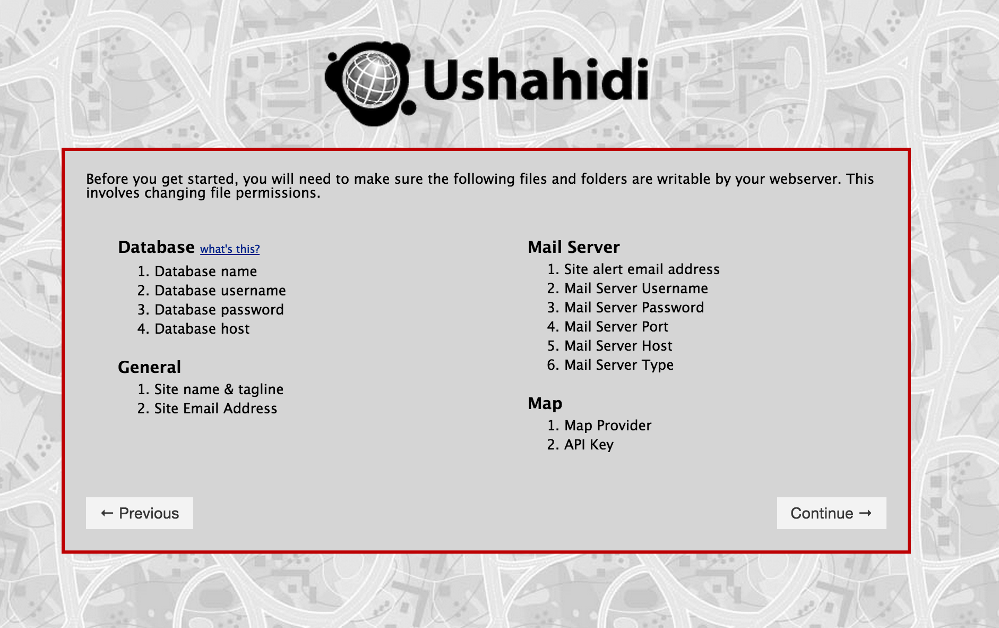

# 1. Installing the Ushahidi platform

If you’ve ever installed WordPress, Drupal, or another, popular, downloadable content management system (CMS) or blogging platform, installing Ushahidi will be a walk in the park. If not, not to worry; like many popular web applications available today, Ushahidi features an installer to walk you through the process.

While we’ll be providing as much detail as possible with each step, this guide assumes you’re comfortable with the following: what PHP and MySQL are, unzipping .zip files, connecting to a remote server via FTP, and setting permissions on directories and files on a remote server. If any of that didn’t make sense, you may want to consult with a web developer who has done this before/may have the skill to do so.

## 1.1 Server requirements

This section outlines the requirements for installing the Ushahidi platform on your computer.

### 1.1.1 The "AMP" (Apache, Mysql, PHP) Stack

Before installing Ushahidi, following must be installed in the target system:

* PHP version 5.2.3 or greater

* PHP 5.4 support is added in Ushahidi 2.6

* Prior to Ushahidi 2.6, you must version between PHP 5.2.3 - 5.3.x

* MySQL version 5.0 or greater

* An HTTP Server. Kohana, which Ushahidi is built on, is known to work with the following web servers:

* Apache 1.3+

* Apache2.0+

* lighttpd

* Microsoft Internet Information Server (MS IIS)

* Nginx

* Unicode support in the operating system

### 1.1.2 Required PHP Extensions

The following is a list of PHP extensions that must be installed on your server in order for Ushahidi to run properly:

* PCRE ([http://php.net/pcre](http://php.net/pcre)) must be compiled with --enable-utf8 and --enable-unicode-properties for UTF-8 functions to work properly.

* iconv ([http://php.net/iconv)](http://php.net/iconv)) is required for UTF-8 transliteration.

* mcrypt ([http://php.net/mcrypt](http://php.net/mcrypt)) is required for encryption.

* SPL ([http://php.net/spl](http://php.net/spl)) is required for several core libraries

* mbstring ([http://php.net/mbstring](http://php.net/mbstring)) which speeds up Kohana's UTF-8 functions.

* cURL ([http://php.net/curl](http://php.net/curl)) which is used to access remote sites.

* MySQL ([http://php.net/mysql](http://php.net/mysql)) is required for database access.

* GD ([http://php.net/gd](http://php.net/gd)) is required for image manipulation.

* IMAP ([http://php.net/imap](http://php.net/imap)) is required for handling e-mails.

**TIP: Need to figure out what extensions you already have installed on your server? Here are instructions to do just that **[http://jontangerine.com/silo/php/phpinfo/](http://jontangerine.com/silo/php/phpinfo/)

### 1.1.3 Optional Server Requirements

To use Ushahidi's "Clean URLs" feature – meaning that your deployment's URLs will not include "index.php" – on an Apache Web Server, you will need the mod_rewrite module and the ability to use local .htaccess files. To check if local .htaccess files are allowed, verify that the "AllowOverride" directive in your Apache config (for the web server directory in which you have installed Ushahidi) has been set to "All".

<Directory [your-document-root-directory]>

...

AllowOverride All

...

</Directory>

## 1.2 Downloading the platform

There are 2 ways to download Ushahidi. 

* Visit the ushahidi downloads page (http://ushahidi.com/downloads), and download the complete application as a .ZIP file.

* For the more tech-savvy, the source code is available on [https://github.com/ushahidi](https://github.com/ushahidi). Github is a popular, hosted version control system. Be sure to use *"git clone --recursive git://github.com/ushahidi/Ushahidi_Web.git"*, or github zip files downloads may be incomplete).

## 1.3 Uploading files and setting permissions

Once you downloaded the files, unzip them and upload them to the server. Once uploaded, you have to change the permissions on a few files and directories. 

Ensure the following directories and files are writable by your webserver

application/logs
application/cache
application/config
media/uploads
.htaccess

If you don’t do this, the Ushahidi installer will recognize this and remind you that this needs to be done during the first step of the installation process and will halt the installation until this is done.

Here are instructions on how to set file permissions on:-

* [Unix/Linux](http://www.washington.edu/computing/unix/permissions.html)

* [Windows](http://support.microsoft.com/en-us/kb/308419)

With the files uploaded and the permission set, you can start installing the application itself.

Begin by visiting your website, either at the "root" directory, subdirectory, or subdomain where you put the files (most likely the “root” directory, meaning you’ll want to visit http://yourdomain.org. (Let’s assume, for the purposes of this guide, that you are installing this into the root folder.)

You’ll be automatically redirected to the installer subdirectory. If all of the files were uploaded, you should see this.

## 1.4 Basic Installation

Choose this option if you want to get up and running quickly; you can always configure everything else later.

### 1.4.1 Getting started

Ensure the following directories and files are writable by your webserver

* application/logs

* application/cache

* application/config

* media/uploads

* .htaccess

If either one of these folders is not writable, you’ll receive a warning that will halt the installation process below.

### 1.4.2 Database requirements

Before we proceed, you’ll have wanted to setup a MySQL database for your website (Ushahidi will not do this for you). If you’re unsure how to do this but using a fairly standard website hosting provider, you likely have access to cPanel or another GUI to help set this up, or other documentation to help.

By now you’ll want your database created and the login information handy, so enter that under "database name," “user name,” and “password.”

There’s a few other fields to take into account:

* *Base Path*: As noted in the installer, this is automatically detected.

* *Database Host*: Most of the time, this will be "localhost," which is why it is prefilled for you. If you’re running on an more custom configured server, such as Amazon S3 or a private server, your database may be running somewhere else, meaning you’ll want to replace localhost with the right domain. This was likely provided for you when you or someone on your team setup the database; contact your hosting provider if you’re unsure.

* *Table Prefix*: As noted in the installation instructions, if you’re installing multiple Ushahidi instances from one database, you’ll need to change the table prefix. However, this is highly discouraged; you should have one database per deployment. It’s recommended you leave this field blank.

Once you have entered all of this information, click the Continue button to move on.

### 1.4.3 Site settings

The next screen covers general information about the website. Your website name,

tagline (or slogan), default language, and site email address are all straightforward.

* *Site email address*: Keep in mind this will be the email address displayed on the website to accept reports, should you enable that functionality.

* *Clean URLs*: What are "Clean URLs?" Clean URLs are URLs that do not display string information in the URL and show only the page and path. This is better explained with an example: Without Clean URLs enabled, here’s what the URL for your about page (once we complete the installation) would look like: [http://yourdomain.com/index.php?page=about](http://yourdomain.com/index.php?page=about). With Clean URLs set to “YES,” your about page will look like this: [http://yourdomain.com/index.php/about](http://yourdomain.com/index.php/about). Clean URLs are preferred as it makes things clearer to the user and improves search engine optimization for your website. It’s recommended you keep this enabled.

### 1.4.4 Admin settings

This section allows you to set an admin username and password that you can use to access your deployment after installation.

## 1.5 Advanced Installation

All parts of the basic installation are included in this section as well, but have some additional steps that will get you into the administration faster for configurations and setup. 

The additional steps include the following below:-

### 1.5.1 Mail settings

Setting up the mail server is important to receive reports via email as well as send out alerts to subscribed users and administrators. As mentioned, this can be tricky depending on your email provider.

If you’re able to use Gmail, Hotmail, or Yahoo, as your email provider (Gmail especially), that can simplify the process. Hints are provided alongside the installer to help you with what you should enter. Again, if you can use one of these, it can make this process much simpler.

If you’re using an email address off your domain, you’ll probably want to check the documentation, knowledgebase, or FAQ to figure out what the proper settings are for the "Mail Server Username," “Mail Server Port,” and “Mail Server Host” fields.

### 1.5.2 Map provider settings

The last step is, fortunately, the simplest. Choose the Map you would like – Google, Bing, ESRI or OpenStreetMap (OSM) – in the dropdown.

## 1.6 Successful installation

You are done!

Follow the links provided to see your website, log in to the administration dashboard, or get right to the next important steps in setting up your website: further configuring the map settings3 and connecting your instance to an SMS server.

Before you start exploring with your new instance, there’s two last things you need to do. Now that the installer is complete, we need to set the permissions on **_application/config/config.php _**and **_application/config/database.php_** to 755. This is a critical step but not one Ushahidi will do for you. Not doing so opens up your deployment to a big security risk.

The second thing you’ll want to do is delete the** "installer"** folder from your website’s file system.

## 1.7 Upgrading Ushahidi

Detailed upgrade instructions can be found on [our wiki page here](https://wiki.ushahidi.com/display/WIKI/Ushahidi+v2.X+Upgrades).

# 1.8 Using Crowdmap Classic

Crowdmap classic is the cloud based version of the Ushahidi platform. It is the easiest, out of the box solution, as you can get setup on your own in just a couple of minutes, with just an email address. It's simple and easy to use, and it resides on our servers, and saves you the hassle and time of having to install the platform on your own. 

* Go to [https://crowdmap.com/switch/classic](https://crowdmap.com/switch/classic)

* Click on "Sign Up"

* **Create your account**. Provide your name, email address and set a secure password

* **Create your deployment address (URL).** Each deployment has its own web address that is unique. No two crowdmap deployments can have the same name. Once set, a deployment address cannot be changed.

* **Enter your deployment details**. Give your deployment a name and give it a tag line

* Accept Terms of Use

* Click on Finish & Create Deployment  

