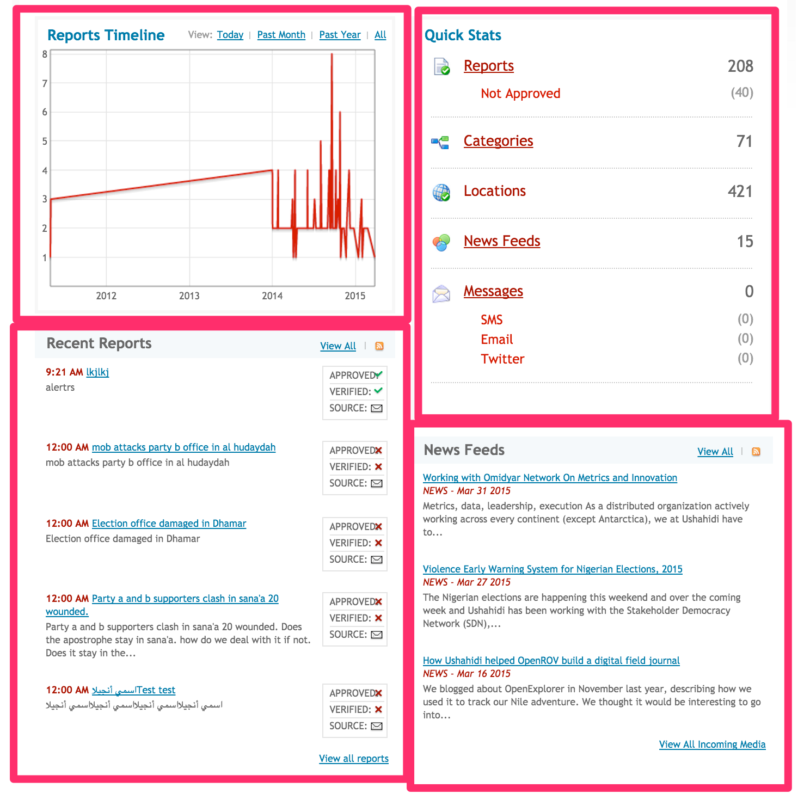
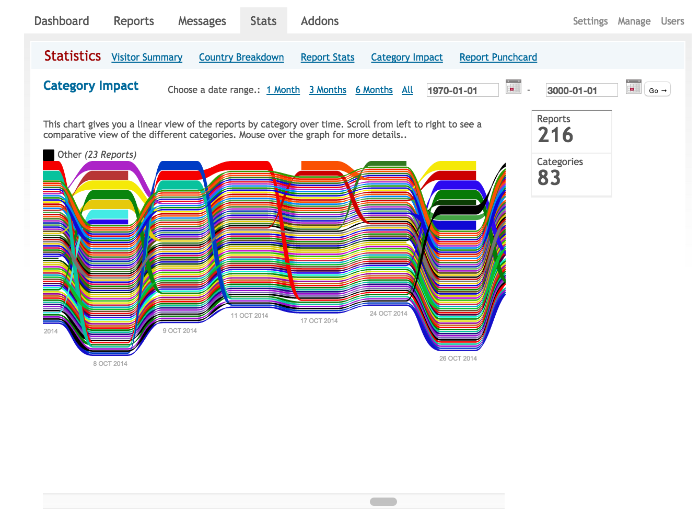

# 3. Processing the Incoming Information

## 3.1 Dashboard

The Dashboard page is the initial page a user is redirected to on logging into the platform. The Dashboard provides a summary of all the information coming into the platform and displays a snapshot of the amount of reports over time.

The Dashboard is composed of four main sections:

* **_The Reports Timeline_**: allowing users to graphically view the trend of reports coming into the platform over a period of time. By clicking on the top right options the admin can see the trend over the past day, month, or year.

* **_The Quick Stats Box_**, which gives an overview of reports in the system. It includes:-

* number of reports received in the platform, and right under it, the number of reports that are yet to be approved

* number of categories set up on the platform

* number of locations created during report approval

* number of messages coming from the following sources

* SMS

* Email

* Twitter 

The admin can access each one of those information pages by clicking on the relative name.

* **_The Recent Reports Box_** gives a summary of the most recent reports submitted by showing the title, the time of the incident, if the report has been approved and verified, and the source. From this box the admin can click on the title to access the report page.

* **_The News Feeds box_** gives you an overview of the RSS feeds coming into the platform.

## 3.2 Stats

The statistics section allows you to see detailed information about the reports that have been submitted and the users of the Ushahidi system. The statistics page has a toolbar which allow the administrator to access the following pages:

* Visitor Summary

* Country Breakdown

* Report Stats

* Category Impact

* Report Punchcard

### 3.2.1 Visitor Summary

The Visitor Summary shows information about people who access or view your ushahidi deployment.

This tracks:-

* Unique Visitors: This shows the number of individuals who have accessed your instance. This is determined using browser cookies. In cases where a  visitor does not have cookies enabled on their browser, they will be identified using a simple heuristic taking into account IP address, resolution, browser, plugins, OS, etc.

* Visits: This is a record of a unique visitor coming to the site more than 30 minutes past his/her last pageview.

* Pageviews: This shows the total number of pages that visitors have viewed on your site.

Visitor information is available over time as well and allows the administrator to see only the statistic for a predefined interval of time by inserting the dates in the opposite fields, or by clicking on the date range buttons, which allows you to choose an interval of 1 month, three months or six months.

Under the graph, you can see a list of days, with an indication of how many unique visitors, visits or page views have been recorded per day, along with percentages.

### 3.2.2 Country Breakdown

This section shows the countries from where users/ individuals accessing your ushahidi deployment are located. Country information is available over time and allows the administrator to see only the statistic referred to a predefined interval of time by inserting the dates in the date fields, or by clicking on the date range buttons, which allows you to choose an interval of one, three, or six months.

The countries that have the higher number of visitors are highlighted in red on the map, while under the map there is the list if the countries with the numbers of unique visitors, visits or page views per day per country and the percentage over the total views.

### 3.2.3 Report Stats

The Report Stats page shows the breakdown of reports on a pie chart, according to three criteria:

* Category

* Verified / Not verified

* Approved / Not approved

Statistical information on reports submitted is also available over time and allows the administrator to see only the statistic referred to a predefined interval of time by inserting the dates in the date fields, or by clicking on the date range buttons, which allows you to choose an interval of one, three, or six months.

A table on the right of the chart indicated the number of reports visualized in the chart and the categories or the verified reports, or the approved reports visualized in the chart.

### 3.2.4 Category Impact

The category impact is a graph that allows the administrator to view reports by category over time. By moving from the left to the right, you are able to see a comparative view of the different categories, while passing the mouse over the category itself, the name of the category and the number of the report submitted in that period of time will appear on the top of the graph.

Statistical information on the reports submitted is available over time as well and allows the administrator to see only the statistic referred to over a predefined interval of time by inserting the dates in the date fields, or by clicking on the date range buttons and choosing an interval of one, three, or six months.

### 3.2.5 Report Punchcard

The Report Punchcard is a graph that depicts the number of reports per day according to the hour of the event. The graph shows in the Y axe the time of the day and in the X axe the day of the week. Looking at the size of the dot in the graph you can easily see which times of which days the majority of the reports where submitted to the platform.

## 3.3 Messages

You can access this section of your deployment by clicking on the *Messages* link on your dashboard. 

All messages coming from SMS, Email and Twitter are listed on this page. 

It’s important to note that messages received within this section will not be displayed publicly until they are processed and transformed into reports first, and then approved.

### 3.3.1 SMS

This page grants you access to:-

* Inbox: Incoming SMS Messages

* *Create report*: If an SMS message has not yet been transformed into a report, this link will appear on the side of each message. Clicking on this link will redirect you to the report creation page, where the body of the SMS will be inserted into the description field. You will only have to add a title, location, category and date and then submit the report.

* *View report*: If an SMS message has already been transformed into a report, this link will appear on the side of the message, in green. Clicking on this link redirects you to view the report created out of this SMS.

* *Reply*: This allows you to respond to text messages. By default, you can insert default replies requesting for more information or location information. You can also reply with your own custom message and click on *SEND*.

* *From*: This displays the phone number from which the text message is coming from. You can make use of the [SMS Anonymizer plugin](https://github.com/ushahidi/Ushahidi-plugin-sms-anonymizer), which encrypts the phone numbers and instead displays a bunch of jumbled up characters, for security purposes.

* *Delete*: You can delete text messages from this section.

* **_Outbox_**: This section displays all Outgoing SMS Messages and allows you to delete them as well.

* **_Trusted_**: Filtered SMS messages from trusted reporters

* **_Spam_**: Filtered SMS messages from phone numbers marked as spam

* **_Reporters_**: A list of all phone numbers that have sent SMS Messages into the platform. From this section, you can:-

* View messages sent by an individual reporter

* Delete an individual reporter and all messages associated with this reporter.

* Mark a reporter as:-

* Trusted - Doing this automatically creates reports out of any SMSes from this reporter, and approves it, meaning any text messages from this reporter will go live on the map, but will remain unverified. 

* Trusted and Verified - Doing this automatically creates reports out of any SMSes from this reporter, approves it AND verifies it, meaning any text messages from this reporter will go live on the map and will be marked as verified.

* Spam - This will flag any messages received by this reporter as spam

* Spam+delete - This will flag and delete any messages received by this reporter as spam.

* Add location information to a reporter by clicking on *Edit. *Adding location information to a reporter allows for location information to be added to any reports that are created from this reporter.

* Search for reporters by phone number

### 3.3.2 Email

This page also grants you access to:-

* **_Inbox_***: *Incoming Email Messages

* *From*: If there is a name instead of the email address, this means that sender of the email has been registered into the platform 

* *Date: *This shows you the date the email was posted.

* *Preview Message*: This link allows the admin to see the entire body of the email. By clicking again on that tab, the body of the email will return in its hidden format.

* *Create report*:  If an Email message has not yet been transformed into a report, this link will appear on the side of each message. Clicking on this link will redirect you to the report creation page, where the body of the Email will be inserted into the description field. You will only have to add a title, location, category and date and then submit the report

* *View Report*: If an Email message has already been transformed into a report, this link will appear on the side of the message, in green. Clicking on this link redirects you to view the report created out of this Email

* *Delete: *You can delete an email message by clicking on this link.

* **_Trusted_****:** Filtered emails from trusted email reporters.

* **_Spam_****:** Filtered Emails flagged as spam

* **_Reporters_**: This works the same way as the reporters page described above in the SMS section of this manual

### 3.3.3 Twitter

### 

This page, much like email and SMS,  grants you access to:-

* **_Inbox_**

* *From: *This shows you the twitter handle from which the tweet was sent

* *Date: *This shows you the date the tweet was posted.

* *Create Report: *If a tweet has not yet been transformed into a report, this link will appear on the side of each message. Clicking on this link will redirect you to the report creation page, where the body of the tweet will be inserted into the description field. You will only have to add a title, location, category and date and then submit the report.

* *View Report: *If a tweet has already been transformed into a report, this link will appear on the side of the message, in green. Clicking on this link redirects you to view the report created out of this tweet

* *Delete: *You can delete a tweet by clicking on this link.

* **_Trusted:_** Filtered tweets from trusted reporters

* **_Spam:_** Filtered tweets from reporters flagged as spam

* **_Reporters_**: This works the same way as the reporters page described above in the SMS section of this manual

## 3.4 Reports

This is where a list of all reports submitted or created on the system can be found. This is easily where you’ll be spending most of your time with the system. This page allows you to:-

* View a full list of reports

* Access details of individual reports

* Manage reports that need to be approved or modified

The Reports page has one toolbar listing actions you can do with the report list: 

* View Reports

* Create Report

* Comments

* Download Report

* Upload Report

* Delete All reports

### 3.4.1 View Reports

In this list of reports, the administrator can see:-

* A report title

* The first sentence of the description field 

* The date

* The location

* The associated categories

* The source i.e the person who created the report, and which channel they used i.e Web, SMS, email, twitter.

This section has its own sub-toolbar which has the following tabs:-

* *Show All:** *You can see all reports within the platform i.e approved and unapproved reports, verified and unverified reports, as well as uncategorized reports. It is important to note here that **_reports submitted on the Ushahidi platform will not appear automatically on the public list of reports or the map; they must first be approved by an administrator with the relevant permissions_***. *Verifying the report is not a requirement to appear on the map, but it does let your viewers know that the information in the report itself has been verified by either another source or the administrator of the platform. [Here’s a guide on verification you can look at](https://wiki.ushahidi.com/download/attachments/4260045/Ushahidi-Verification-Guide.pdf?version=1&modificationDate=1375995186000&api=v2).

On the side of each report, you can see the following actions:-

* **_Approve_**:

* If this link is **green**, this means **this report has been approved**. Clicking on it prompts you to unapprove it.

* If this link is **blue and underlined**, this means t**his report has NOT been approved**. Clicking on it prompts you to approve it.

* **_Verify	_**

**_		_**

* If this link is **green**, this means **this report has been verified**. Clicking on it prompts you to unverify it.

* If this link is **blue and underlined**, this means **this report has NOT been verified**. Clicking on it prompts you to verify it.

* **_Delete: _**Allows you to delete a single report.

You’ll also note that you can conduct actions on bulk reports by clicking on the tick boxes adjacent to the report title, and selecting the action in the sub toolbar above.

* *Awaiting Approval :* This tab only lists reports that have not yet been approved, which means that they have been submitted but do not appear on the map.

* *Awaiting Verification: *This tab only lists reports that have not yet been verified. This may include reports that have already been approved. 

* *Uncategorized reports: *This tab only lists reports that may have been uploaded with no category information, and are thus uncategorized.

* *Search/Advanced Search: *This section allows you to perform an advanced search on reports listed. Point to note is that the search results returned will match ANY of the search criteria, as opposed to matching ALL search criteria. The search operation conducted here used the OR operator.

An administrator can view individual report details by clicking on the report title, which will then redirect him/her to the report edit page(which is the report creation form, with fields pre populated with information from the individual report). Sections in the report creation field will be described in detail in the [Create Report Section](#heading=h.tfkuah7ouwj5).

### 3.4.2 Create Report

This report creation form is identical to the report creation page on the front end of your deployment, but with the following additional details:-

* Information Evaluation box: Which allows the administrator to approve and/or verify a report directly during report creation

* Hidden forms, form fields and categories(Those not visible on the front end) are visible to the administrator on this page.

Fill in the following details:-

* **_Form Type_***: *Select a form from a list of custom forms created on your deployment

* **_Title: _**Provide a brief title for your incident

* **_Description: _**Provide a detailed description of what your incident is all about

* **_Date: _**By default, the platform will set the date and time of creation, based on timezone set on your deployment. You can alter this to reflect the date an incident occured

* **_Categories: _**Select the relevant categories that match the event being reported

* **_Location: _**If unable to locate the specific location on the map, you can type in the name of the location you’re trying to find, in as much detail as possible, and the red marker on the map will move. You can alternatively drag and drop the red pointer to the desired location. You can also draw lines and polygons on areas, as well as set multiple markers on a location.

* **_Location Name_**: This field cannot be left blank. Please provide the name of the location selected above.

* **_(Optional) News source link, Video link, Upload Photos_**, if you have any.

* **_Custom form fields: _**Select your custom form field responses.

* **Information Evaluation**: This box has two questions to ask of the administrator:-

* *Approve this report?* If the information in the report makes sense, the admin will approve the report by clicking "Yes" next to “Approve this report”. The report will then appear on the map as a dot.

* *Verify this report? *The administrator will select "Yes" to verify report if he/she has direct knowledge about the event and can be sure that it is true. It is strongly suggested not to click on verified if it is not possible to confirm the information in the report.

* **_(Optional) Personal Information_** - You can opt to share your contact information, which would only be made visible to administrators on the platform and would not be publicly displayed.

When satisfied with the review of the report, you can click on Save Report or Save and Close button, so that the report will be publish on the website. 

### 3.4.3 Comments

The comments section allows the administrator to view and manage all comments that are submitted to reports on the website.

The comment lists allows the administrator to:-

* View all comments in the system that are :-

* Awaiting Approval, 

* Have already been Approved

* Have been identified as spam

You can see the following information on each comment:-

* Who submitted the comment

* Which report the comment is in response to

* The comment content

* IP Address from where the comment was submitted

* Date the comment was submitted.

* Approve and unnapprove comments

* If this link is **green**, this means **this comment has been approved**. Clicking on it prompts you to unapprove it.

* If this link is **blue and underlined**, this means **this comment has NOT been approved**. Clicking on it prompts you to approve it.

* Mark comments as spam

* Delete comments 

### 3.4.4 Download Reports

This section allows the administrator to download all the reports, either as a CSV(Comma Separated Values) file or XML(Extensible Markup Language) file. There are options to choose:-

* Data points to download

* Approved Reports

* Verified Reports

* Reports Awaiting Approval

* Reports Awaiting Verification

* (Optional) Within a specific date range

* Additional information to download

* Latitude

* Longitude

* Location Information

* Description

* Categories - It’s important to note that when downloading as a CSV, all categories, irrespective of top level or sub category, are separated by a comma in a single column.

* Personal information

* Custom fields

Once the desired selection has been made, click on the Download tab.

### 3.4.5 Upload reports

This section allows you to import incidents into the Ushahidi platform. This functionality is useful in cases where you need to upload reports from people that cannot send them to you via email or phone but have the data available in a CSV file. This functionality is also useful in cases where you are transferring reports from one platform to another (minding that both platforms are using identical versions of the software).

#### 3.4.5.1 Rules

* Reports must be uploaded in either CSV or XML format..

* When incident ID already exists in the database, the entry in the CSV/XML file will be ignored..

* It must contain at least Incident Title and Incident Date.

* If no latitude and longitude columns are supplied, the location will be geocoded using the Google Geocoder.

##### Importing Custom form fields/Personal information

**_If importing additional info i.e personal information and/or custom form fields_**

* At least one of the personal information fields(name, surname,email) entries MUST exist. Empty records will not be imported

* Custom field columns must have their form_id appended to them e.g custom field Test, on the default form, whose id is 1, will be Test-1. During custom form field import, ensure that

* Your entries for dropdown fields, radio buttons and checkboxes match the options provided for the custom field on your instance

* Checkbox options are separated by a comma e.g if your selected choice of fruits is apples,mangoes and grapes, your entry for this should be "apples,mangoes,grapes"

* Date field values are in the following format: mm/dd/yyyy e.g 3rd October 2012 = 10/03/2012

View our report upload guides for more information:-

* [XML Upload guide](https://wiki.ushahidi.com/display/WIKI/XML+Upload+Guide)

* [CSV Upload guide](https://wiki.ushahidi.com/display/WIKI/CSV+Upload+Guide)

#### 3.4.5.2 Sample CSV Report

#,INCIDENT TITLE,INCIDENT DATE,LOCATION,DESCRIPTION,CATEGORY,APPROVED,VERIFIED,LATITUDE,LONGITUDE

"1","Suspected death in Nairobi","2009-05-15 01:06:00","Nairobi","Three cases have been confirmed in C. del Uruguay","DEATHS, CIVILIANS, ",YES,YES,"-1.287","36.821"

"2","Looting","2009-03-18 10:10:00","Accra","Looting happening everywhere","RIOTS, DEATHS, PROPERTY LOSS, ",YES,NO,"5.55","-0.2166667"

**_NB: It was detected that Microsoft Excel For Mac has some compatibility issues with uploading reports into the Ushahidi platform especially in cases where RTL languages are used. Microsoft does not support RTL languages. It is therefore recommended that alternative spreadsheet editors such as OpenOffice be used in such instances_**

### 3.4.6 Delete all reports

Using this function will delete ALL reports on the database. You should use this with caution as this operation cannot be undone. It is recommended that you backup your database before proceeding