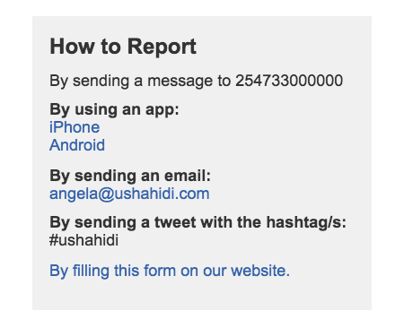
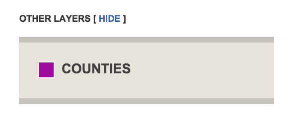
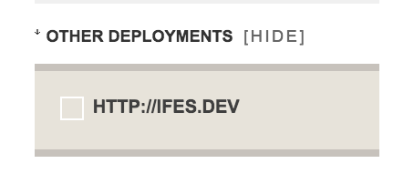

# 4. The User Interface

## 4.1 Homepage

Your ushahidi deployment homepage consists of different sections, each providing you with different information:-

* Main map

* Category filter

* The timeline

* How to report box

* Incident Block

* Official and mainstream news block

* Other deployments

* Static layers

In addition, the toolbar has the following navigation item links:-

* Reports

* Submit a report(if enabled by the administrator)

* Get Alerts(if a site email address is provided and this is enabled by the administrator)

* Contact us(if a site email address is provided and this is enabled by the administrator)

* Any custom pages you add in the Pages section of the platform will also appear on this toolbar, e.g About Us

There are also 3 additional buttons at the top of the toolbar

* Submit a report - which redirects you the report submission page

* Languages - which allows a user to select the language in which they would like to navigate around the platform

* Search

### 4.1.1 The Map

### 

This main map is interactive and is composed of the following parts:-

* **_Base Map_** - The map layer displayed to you here depends on which base map the administrator in the [map settings page](#heading=h.yzx6z6hozf5t)

* **_Zoom bar_** - This allows you to zoom in and out of the map. If reports are clustered, the more one zooms out, the more the reports get aggregated, and the larger the dots appear. The more one zooms in, the more reports will separate one from another and appear as a single dot.

* **_Dots on the map_**: These dots on the map represent reports submitted to the Ushahidi platform, and the location of the events reported. If the administrator chooses to have reports clustered on the map, reports in a similar location will be clustered and will appear as larger dots with a number on it, showing you how many reports are in that location. By clicking on a marker/dot on the map, an info window will appear showing you the title of that report. If you click on a clustered dot, the list of titles of all reports in that area will appear. If you then click on the title, the platform will forward you to the report itself, where you will be able to read the entire description of the report

* **_Layer button_** - The little (+) sign allows you to switch from one base map layer to the other, based on the map provider selected by the Administrator. You can also add or remove the reports layer on the map itself

### 4.1.2 Categories

This filter enables you to interact with the map even more. It allows you to filter the reports on the map based on which category they belong to. 

Clicking on all categories will display all reports submitted to the Ushahidi platform, while clicking on a certain category will display only the reports related to that specific category or sub-category. The color of the dots on the map will correspond to the category/sub-category selected on this filter. If any category icons have been assigned, these icons will display, instead of the dots on the map. Users can see view reports belonging to one category or sub-category at a time

### 4.1.3 The timeline

If using the Default, bueno or terra theme, and the administrator has enabled the setting to display the timeline on the homepage, you should be able to view a timeline of events right under the map. 

This timeline shows the number of reports mapped over time and by default shows the overall trend of the reports from the beginning of your deployment to the current day as a static graph. To view reports published over a given period of time, you just have to provide the date range in the date fields below the map. This will set the time interval you want to look at, and only reports within this date range will be displayed on the map.

The timeline can also be used in coordination with the map, turning the default, static visualization into a dynamic visualization displaying the reports as they were added to the system by clicking on the **_Play_** button. If you want to view an animation of the reports mapped over time and space over a certain period of time, simply insert the dates in the two boxes and click on the Play button

### 4.1.4 How to report box

This section provides visitors/users of the platform with more information on how to submit reports into the platform.

The Ushahidi platform allows for reporting via email, sms, twitter, the web form and smartphone applications on the iOS and Android. 

As long as the administrator has set up the platform to receive reports from the channels above, the how to report box will have information describing how to report via these channels

* **_Email_**: If a site email address is provided, this email address will be displayed here

* **_Twitter_**: If twitter has been properly set up and hashtags provided, they will be listed here

* **_SMS_**: If SMS numbers are provided and properly set up, they will be listed here

* **_Smartphone apps_**: Links to the default smartphone applications on the iOS and Android store are provided here.

### 4.1.5 Incident Block

The Incident List Box appears below the map(or timeline if enables) and it shows the list of reports in chronological order starting from the most recent one. The list shows the title of the report, the location, and the date the incident was reported to have occurred. 

By clicking on the title you will be directed to the individual report view page, where you will be able to see the description of the event and all the specifications of the event reported

### 4.1.6 Official and Mainstream Block

The Ushahidi platform provides the ability to subscribe to RSS feeds from other websites and to display them on your website. This feature is optional but in some projects, particularly those that may be actively covered by the mainstream media or bloggers, it can be useful to provide additional context about your project without having to include related but not actionable content on your map.

If you choose to include [news feeds](#heading=h.bxbwwyjvcmdg) on your homepage, they will appear in a block titled "Official and Mainstream news". These news items will come from different website, blogs, twitter accounts, or anything relevant that the administrator of the platform decided to subscribe to.

The list shows the title of the news item, the source, and the date it has posted. This box works like a Google Reader, and by clicking on the title of the news you will be directed to the original source of the information.

### 4.1.7 Static Layers

Static layers are useful for your project in displaying information such as different regions, states, or provinces; demographic information; borders; or other general information that may help provide additional context to the real time information you are gathering on the ground, but information you don’t want to include as reports to clutter up your other sources. Ushahidi provides the means to include and abstract this information from your reports as well as the option for your users to toggle this information on or off depending on their preference.

These static layers are added as KML/KMZ files in the [Layers section](#heading=h.paurt55df1tn) of the admin panel. Those files contain information about static points or areas on your map. For example, these static points can represent refugee camps, or police stations, hospitals, geographic regions or risk areas. The reason you wouldn’t want to submit this information as reports for your map is because they will appear as incidents, which are likely to confuse your viewers. Adding these static layers allows you to view this data in relation to reports you have mapped, which can help you identify possible connections between those static locations and the dynamic events happening in the same area.

The static layer box only appears if you have any active and visible layers, and would be listed under the category box(if using the Default, bueno or terra themes) under "*Other Layers*". If using the Unicorn theme, this box will appear on the top left hand corner of your page.

Clicking on a static layer will show your points related to the layer selected on the map. You can chose to view multiple static layers on the map at the same time.

### 4.1.8 Other deployments

The ushahidi platform allows you to overlay reports from other deployments on the main map, abstracted from reports on your own deployment.

This block only appears if [the sharing plugin](#heading=h.dc6ag4tg3lcv) is activated and there are active ushahidi deployment links that have been made visible. 

This box would be listed under the category box and Static Layers Link(if using the Default, bueno or terra themes) under "*Other Deployments*". If using the Unicorn theme, this box will appear on the top left hand corner of your page.

## 4.2 Reports Listing

Clicking on the reports tab redirects you to this page, which shows you a list of all approved reports within your deployment from the time your deployment was created, to date.

You can specify a date range within which you would like to view reports on this page.

There are 2 default views provided to you on this page:-

* List view

* The reports listed have a small green or red highlight on the left hand side of the report. Green denotes a verified report, and red denotes an unverified report.

* You can also see thumbnails of any images attached to the report, if any are available.

* You can also see a summary of the number of comments attached to this report

* You should also see the report titles, description summary and date of the report from this view.

* Map view

* This view displays reports as green dots on the map. Clicking on each dot will display a pop up with the report title, which links to the individual report view page

### 4.2.1 Filter

You can filter reports on this page according to:-

* *Category: *You can filter reports on this page by multiple categories at a time, unlike the homepage which only allows you to select one category at a time.

* *Location: *You can set a location range within which you would like to search for reports.

* *Type/Source: *You can filter reports based on which source they came from i.e SMS, Email, Twitter, Web

* *Media: *You can search for reports that have any media items attached to them i.e videos or images

* *Verification status: *You can search for/filter reports based on whether they are verified or not

* *Custom form field responses: *You can search for/filter reports based on custom form field responses.

You can select multiple search/filter criteria from the list above, and clicking on filter reports will return results that meet ALL the criteria selected above.

### 4.2.2 View individual report

Clicking on the report title will access the full report with all of the information. The complete report details from the report page are the following:

* Map visualization

* Date, time and location of the incident

* Category information

* Verification status

* Description

* Comments added by users

* Additional Reports related to that event

In addition, there’s a small upvote/downvote functionality at the top of the Comment Box that allows the viewer to give scores to the report. Upvotes/downvotes do not affect the verification status of the report, or of the comment, but give the administrator and other users an idea of what people think about the credibility of a report or comment.

## 4.3 Submit report

To access this form, click the "Submit a report" link on the menu bar. This link is only visible if the administrator has enabled the setting allowing for users to submit reports on the platform.

Submitting a report to an Ushahidi platform is as easy as filling in any online form; administrators will appreciate that the layout of the form is identical to the finished reports. Even geo-locating your report is as simple as clicking on the map provided; Ushahidi will figure out the latitude and longitude for you.

If a Submit Report Message is provided by the administrator, it will appear on the top of this page.

The following fields are available on a the report submission page:-

* *Title: *The person reporting the event/incident needs to provide a brief description of the incident. The title is the first thing that users of the map will see, so it is important that the title gives an idea of what happened and where.

* *Description: *The reporter should provide a little more detail by describing the event in a few sentences. The description should be brief, but comprehensive, with all the additional information that is relevant to the event reported. It is important to include the following pieces of information: ‘who’, ‘what’, ‘where’, ‘when’, ‘how’ and any additional, contextual information that you feel is important.

* *Date: *This should refer to the date and time of the event being reported, rather than when the report is submitted. Note that the system automatically picks the date and time when the report is being posted, so the reporter will need to change the entry if the event happened on a different date than when the report is being submitted.

* *Categories:***_ _**The reporter**_ _**must select at least one category type, but can select as many categories as possible. To view sub categories under a top level category, you need click on the plus sign placed before the category and a scroll down menu will appear with all the sub-categories. Correct categorization is important and should not be rushed. In general, try to select just one category if possible.

* *Map(and Find Location tab)***_:  _**The map allows viewers to visually provide the location of the incident. If the name of the street, address, or GPS coordinates are not known, but the reporter can find the location on the map, she can double click on the location of the event on the map to place the red marker there. This will automatically record the coordinates and point on the Ushahidi map. If unable to locate the specific location on the map, you can type in the name of the location you’re trying to find, in as much detail as possible, and the red marker on the map will move. You can alternatively drag and drop the red pointer to the desired location. You can also draw lines and polygons on areas, as well as set multiple markers on a location.

* *Location Name*: This field cannot be left blank. Please provide the name of the location 

* *Custom form fields: *Enter your custom field responses

* *News Source Link: *This section should be used only if the report being submitted is from an online source: the box allows inserting only a URL address. If the information is coming from more than one online source, a user can insert as many links as required by clicking on the plus ("+") symbol on the side of the box

* *External Video Link: *Reporters can add links to videos related to the event reported. It is important to be sure that the video is relevant to the accident monitored. Note that the Ushahidi platform doesn’t allow you to upload videos to the platform; the reporter can provide a URL to a video hosted elsewhere (such as YouTube).

* *Upload Photos: *The reporter can also upload a photo related to the event reported. Again it is important to be sure that the format is JPG or similar and that the picture is relevant to the event being reported on. 

* *Personal Information: *The reporter may include her personal information with report: first name, last name and email address. Typically, this is important information to be include because if there is missing information in the report, or mistakes, the administrator can immediately contact the reporter for clarification. This is not required for the system to accept the report, but it can enormously help the managers of the platform. It’s also good to note that this information will only be made available to administrators of the platform, and not made publicly visible, to protect privacy of users who submit reports.

	

## 4.4 Get Alerts

This page is only visible if the administrator has enabled the setting allowing for users to subscribe for alerts and provides an email address from which alerts will be sent out from. 

This allows users to subscribe for alerts on :-

* Mobile phone: This option will only be made available if the platform has been set up to receive and send SMS messages.

* Email

These alerts can be set to a specific location range and on (optionally) specific categories.

To set up an Alert via email or SMS it is just matter of four easy steps:

* Click the "Get Alerts" tab on the home page.

* Select the location to receive alerts about and the size of the area. The system will send an alert whenever a report is entered within 1/5/10/20/50/100 km from this location.

* Select mobile or email alert and enter mobile phone number or email address (or both).

* You can also optionally select multiple categories of information you would like to receive alerts from.

* Click "Save Alert".

## 4.5 Contact Us

This page is only visible if the administrator has enabled the setting to allow the contact page to be displayed, and the site email address has been provided.

The form asks for personal information like name, email address and phone number in addition to message subject and text, and has a security code to protect the deployment from Spam.

## 4.6 Additional Buttons

### 4.6.1 Languages

This drop down on the top right hand corner allows any user to select the language they would like to operate with on the platform. Note that this does not affect the default language set by the admin in the Settings page.

### 4.6.2 Search

The search option on the top right hand corner allows you to look for specific reports within the Ushahidi platform. By typing into the box the key word the system will give you all the reports, in chronological order, starting from the most recent one, that contains or matches that search terms provided.

